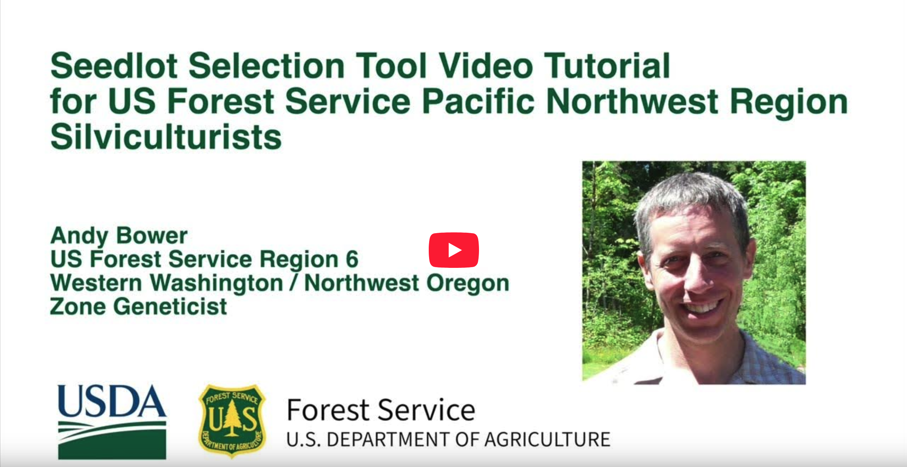

:figure-caption!:

=== Layers

The *Layers* tab allows the user to map different overlays onto the results. Options include gray-scaled values for
different climate variables, seed and breeding zone boundaries, U.S. Level III Ecoregion boundaries, and U.S. county
boundaries. _(Under construction: some species ranges will be added as an option for layers.)_

=== Saved Runs

The *Saved Runs* tab will list each of your saved runs. Click on the name of the saved run to `Load` or `Delete` the
inputs. Once a saved run is loaded, you can recreate the map by clicking on the `Run Tool` button in the Tool tab.

=== Account

Use the *Account* menu in the upper right corner of the web site to create or sign into an account. Use an email
address and password to create an account. We will use this email address only if you lose your password. If you want
to receive updates on the SST, sign up for our newsletter by clicking the `News & Updates` button in the menu.

<<<

=== Video Tutorial

The following video tutorial demonstrates how to use the Seedlot Selection Tool. The tutorial was developed for silviculturists working in the Pacific Northwest region. It's also applicable to any region in the US where trees are being planted to be resilient to future climate.

.Watch the tutorial at https://youtu.be/HYuOTY8WgEc
[#img-sunset,link=https://youtu.be/HYuOTY8WgEc]

=== References

Aitken, S.N. and J.B. Bemmels. 2015. Time to get moving: assisted gene flow of forest trees. Evolutionary Applications 9(1): 271-290.

Alberto, F., S.N. Aitken, R. Alia, SC. Gonzalez-Martinez, H. Hanninen, A. Kremer, F. Lefevre et al. 2013. Potential for evolutionary responses to climate change – evidence from tree populations. Global Change Biology 18: 1645-1661.

Baughman, O.W., A.C. Agneray, M.L. Forister, F.F. Kilkenny, E.K. Espeland, R. Fiegener, M.E. Horning, R.C. Johnson, T.N. Kaye, J. Ott, J.B. St.Clair, E.A. Leger. 2019. Strong patterns of intraspecific variation and local adaptation in Great Basin plants revealed through a review of 75 years of experiments. Ecology and Evolution 2019-9: 6259-6275.

Leimu,R. and M. Fischer. 2008. A meta-analysis of local adaptation in plants. PLoS ONE 3(12): e4010.

Sáenz-Romero, E. Mendoza-Mata, E. Gómez-Pineda, A. Blanco-Garcia, et al. 2020. Recent evidence of Mexican temperate forest decline and the need for ex situ conservation, assisted migration, and translocation of species ensembles as adaptive management to face projected climatic change impacts in a megadiverse country. Can. J. For Res. 50: 843-854.

St.Clair, John Bradley, Bryce A. Richardson, Nikolas Stevenson-Molnar, Glenn T. Howe, Andrew D. Bower, Vicky J. Erickson, Brendan Ward, Dominique Bachelet, Francis F. Kilkenny, and Tongli Wang. 2022. Seedlot Selection Tool and Climate-Smart Restoration Tool: Web-Based Tools for Sourcing Seed Adapted to Future Climates. Ecosphere 13(5): e4089. https://doi.org/10.1002/ecs2.4089

Van Mantgem, N.l. Stephenson, J.C. Byrne, L.D. Daniels, J.F. Franklin, P.Z. Fulé, M.E. Harmon, A.J. Larson, J.M. Smith, A.H. Taylor, T.T. Veblen. 2009. Widespread increase of tree mortality rates in the Western United States. Science 323: 521-524.

Wang, T., A. Hamann, D.L. Spittlehouse, and C. Carroll. 2016. Locally downscaled and spatially conceptualized climate data for historical and future periods for North America. PLoS ONE 11(6): e0156720.

==== Trait functions

Still, S. M., & Richardson, B. A. (2015). Projections of Contemporary and Future Climate Niche for Wyoming Big Sagebrush (Artemisia tridentata subsp. wyomingensis): A Guide for Restoration. Natural Areas Journal, 35(1), 30–43. http://doi.org/10.3375/043.035.0106

Chaney, L., Richardson, B. A., & Germino, M. J. (2017). Climate drives adaptive genetic responses associated with survival in big sagebrush (Artemisia tridentata). Evolutionary Applications, 10(4), 313–322. http://doi.org/10.1111/eva.12440

Richardson, B. A., Chaney, L., Shaw, N. L., & Still, S. M. (2017). Will phenotypic plasticity affecting flowering phenology keep pace with climate change? Global Change Biology, 23(6), 2499–2508. http://doi.org/10.1111/gcb.13532

Richardson, B. A., & Chaney, L. (2018). Climate-based seed transfer of a widespread shrub: population shifts, restoration strategies, and the trailing edge. Ecological Applications, 44, 367–10. http://doi.org/10.1002/eap.1804

Rehfeldt, G. E., Ying, C. C., Spittlehouse, D. L., &  Hamilton Jr, D. A. (1999). Genetic responses to climate in Pinus contorta: niche breadth, climate change, and reforestation. Ecological Monographs, 69(3), 375–407. https://doi.org/10.1890/0012-9615(1999)069%5B0375:GRTCIP%5D2.0.CO;2[https://doi.org/10.1890/0012-9615(1999)069$$[0375:GRTCIP]$$2.0.CO;2]

Rehfeldt, G. E. (2004). Interspecific and intraspecific variation in Picea engelmannii and its congeneric cohorts: biosystematics, genecology, and climate change. Gen. Tech. Rep. RMRS-GTR-134. Fort Collins, CO: U.S. Department of Agriculture, Forest Service, Rocky Mountain Research. 18 p., 134. https://doi.org/10.2737/rmrs-gtr-134

St. Clair, J. B., Kilkenny, F. F., Johnson, R. C., Shaw, N. L., & Weaver, G. (2013). Genetic variation in adaptive traits and seed transfer zones for Pseudoroegneria spicata (bluebunch wheatgrass) in the northwestern United States. Evolutionary Applications, 6(6), 933–948. https://doi.org/10.1111/eva.12077
