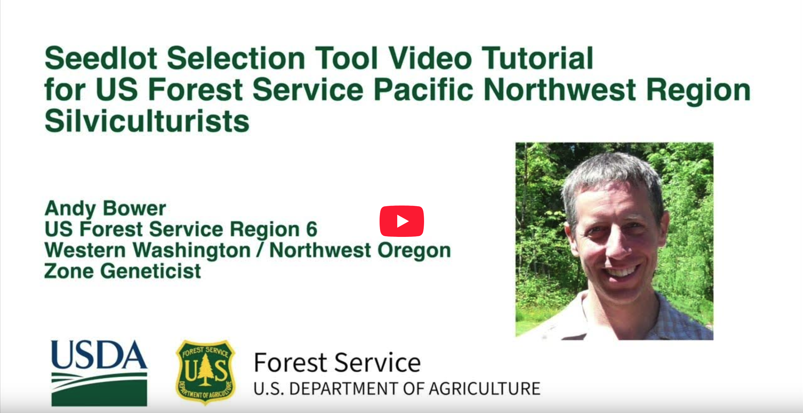

:figure-caption!:

=== Capas

La pestaña *Layers* (Capas) permite al usuario mapear diferentes capas superpuestas a los resultados. Entre las opciones figuran valores de escala de grises para las diferentes variables climáticas, los límites de zonas de origen de las semillas y de mejoramiento, los límites de la Región Ecológica Nivel III de los Estados Unidos, y los límites de los condados de los Estados Unidos. _(En construcción: se añadirán algunas gamas de especies como opción para las capas.)_

=== Ejecuciones guardadas

En la pestaña *Saved Runs* (Ejecuciones guardadas) verá una lista de todas las ejecuciones guardadas. Haga clic en el nombre de la ejecución guardada para “Cargar” o “Eliminar” las entradas. Una vez que cargue una ejecución guardada, puede volver a crear el mapa haciendo clic en el botón “Run Tool” (Ejecutar herramienta), en la pestaña “Tool” (Herramienta).

=== Cuenta

Utilice el menú *Account* (Cuenta), ubicado en la esquina superior derecha del sitio web, para crear o iniciar sesión en una cuenta. Utilice una dirección de correo electrónico y una contraseña para crear la cuenta. Utilizaremos la dirección de correo electrónico que nos proporcione únicamente si pierde u olvida su contraseña. Si desea recibir actualizaciones sobre la SST, suscríbase a nuestro boletín haciendo clic en el botón “News & Updates” (Noticias y actualizaciones) del menú.

<<<

=== Video Tutorial

En el siguiente tutorial de vídeo se muestra cómo utilizar la herramienta de selección de lotes de semillas. El tutorial fue desarrollado para silvicultores que trabajan en la región del noroeste del Pacífico. También es aplicable a cualquier región de los EE. UU. donde se estén plantando árboles para que sean resistentes al clima futuro.

.Mira el tutorial en https://youtu.be/HYuOTY8WgEc
[#img-sunset, link=https://youtu.be/HYuOTY8WgEc]

=== Referencias

Aitken, S.N. y J.B. Bemmels. 2015. Hora de ponerse en movimiento: flujo genético asistido de árboles forestales. Aplicaciones Evolutivas 9(1): 271-290.

Alberto, F., S.N. Aitken, R. Alia, SC. Gonzalez-Martinez, H. Hanninen, A. Kremer, F. Lefevre et al. 2013. Potencial de respuestas evolutivas al cambio climático: evidencia de las poblaciones de árboles. Biología del Cambio Global 18: 1645-1661.

Baughman, O.W., A.C. Agneray, M.L. Forister, F.F. Kilkenny, E.K. Espeland, R. Fiegener, M.E. Horning, R.C. Johnson, T.N. Kaye, J. Ott, J.B. St.Clair, E.A. Leger. 2019. Fuertes patrones de variación intraespecífica y adaptación local en plantas de la Gran Cuenca revelados a través de una revisión de 75 años de experimentos. Ecología y Evolución 2019-9: 6259-6275.

Leimu, R. y M. Fischer. 2008. Un meta-análisis de la adaptación local en las plantas. PLoS ONE 3(12): e4010.

Sáenz-Romero, E. Mendoza-Mata, E. Gómez-Pineda, A. Blanco-García, et al. 2020. Evidencia reciente del declive del bosque templado mexicano y la necesidad de conservación ex situ, migración asistida y translocación de conjuntos de especies como manejo adaptativo para enfrentar los impactos proyectados del cambio climático en un país megadiverso. 50: 843-854.

Van Mantgem, N.l. Stephenson, J.C. Byrne, L.D. Daniels, J.F. Franklin, P.Z. Fulé, M.E. Harmon, A.J. Larson, J.M. Smith, A.H. Taylor, T.T. Veblen. 2009. Aumento generalizado de las tasas de mortalidad de árboles en el oeste de los Estados Unidos. Ciencia 323: 521-524.

Wang, T., A. Hamann, D.L. Spittlehouse y C. Carroll. 2016. Datos climáticos localmente reducidos y conceptualizados espacialmente para períodos históricos y futuros de América del Norte. PLoS ONE 11(6): e0156720.

==== Artemisa grande

Still, S. M. y Richardson, B. A. (2015). Proyecciones de un nicho climático contemporáneo y futuro para la artemisa grande de Wyoming (Artemisia tridentata subsp. wyomingensis): una guía para la restauración. Revista de Áreas Naturales, 35(1), 30–43. http://doi.org/10.3375/043.035.0106

Chaney, L., Richardson, B. A., & Germino, M. J. (2017). El clima impulsa respuestas genéticas adaptativas asociadas con la supervivencia en artemisa grande (Artemisia tridentata). Aplicaciones Evolutivas, 10(4), 313–322. http://doi.org/10.1111/eva.12440

Richardson, B. A., Chaney, L., Shaw, N. L., & Still, S. M. (2017). ¿La plasticidad fenotípica que afecta a la fenología de la floración seguirá el ritmo del cambio climático? Biología del Cambio Global, 23(6), 2499–2508. http://doi.org/10.1111/gcb.13532

Richardson, B. A., & Chaney, L. (2018). Transferencia de semillas de un arbusto generalizado basada en el clima: cambios en la población, estrategias de restauración y el borde de salida. Aplicaciones Ecológicas, 44, 367–10. http://doi.org/10.1002/eap.1804
